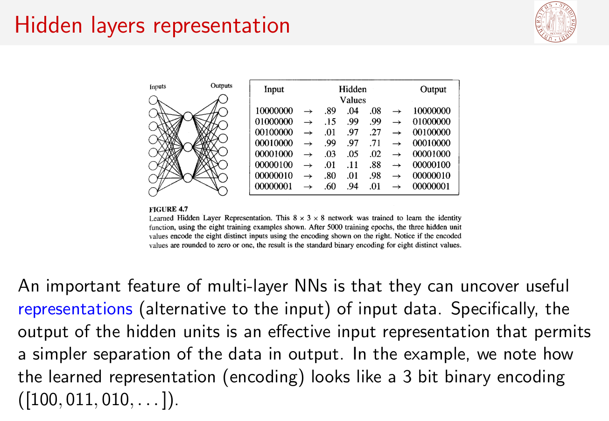

# MyThreeLayerAutoEncoder

The provided autoencoder has been designed from scratch, using NumPy and Pandas libraries. As an input, we pass \
one-hot-vectors and want the autoencoder to encode these vectors as binary numbers. The following picture contains \
an example with autoencoder with three layers. The code can be used for any number of hidden layers.

